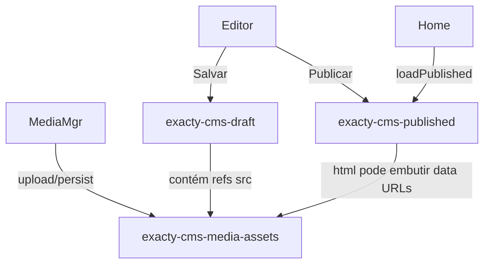

# CMS Data Model Audit (Etapa 3)

Auditoria das chaves/formatos atuais do CMS antes da modelagem Prisma.  
Fonte: `src/cms/repositories/*`, `src/cms/storage.ts`, `src/cms/mediaManager.ts`.

## Mapa localStorage → tabelas futuras

| Chave atual | Origem | Formato | Finalidade | Tabela Prisma (Etapa 3) |
|-------------|--------|--------|------------|-------------------------|
| `exacty-cms-draft` | `LocalStorageRepository.saveDraft/loadDraft` via GrapesEditor Salvar | JSON GrapesJS (`getProjectData()`): pages, frames, components, styles, assets refs | Rascunho editável do site | `Page.content` (working copy) + `Version` (snapshots futuros) |
| `exacty-cms-published` | `savePublished/loadPublished` via Publicar + Home | `{ html: string, css: string, updatedAt: string }` | Snapshot HTML/CSS da página publicada | `Version` com `status = "published"` (`content` = html/css) e/ou vínculo à `Page` |
| `exacty-cms-media-assets` | AssetManager + biblioteca PDF/imagens | `Array<{ type, src, name }>` — `src` frequentemente **data URL base64** | Catálogo de PDFs e imagens | `Asset` — **metadados + `url`/`storagePath`**; binário **fora** do JSON da página |

## Domínios sem chave localStorage

| Domínio | Origem atual | Tabela futura |
|---------|--------------|---------------|
| Auth CMS | Cookie HttpOnly + `CMS_USERNAME`/`CMS_PASSWORD` (plugin Vite) | `User` (estrutura inicial; auth real em etapa posterior) |
| Settings | Inexistente | Futuro `Setting` (não nesta migration) |
| Components | Embutidos no JSON do draft GrapesJS | Continuam dentro de `Page.content` / `Version.content` |
| Project | Implícito (um site único) | `Project` (container; seed default `exacty-med` na Etapa 4) |

## Relação entre dados (estado atual)

## Decisões de modelagem (Etapa 3)

1. **Um `Project`** representa o site Exacty Med (multi-página depois).
2. **`Page`** guarda o conteúdo GrapesJS de trabalho (`content` Json).
3. **`Version`** guarda snapshots (`draft` / `published`) sem apagar histórico.
4. **`Asset` separado**: só metadados + URL/path — evita inflar `Page`/`Version` com base64 (risco identificado na Etapa 2).
5. **`StorageEntry` permanece** para a API KV e migração gradual.
6. **Nenhuma migração de dados** nesta etapa — só schema + repositories vazios.

## Status

| Item | Status |
|------|--------|
| Auditoria | Concluída |
| Models Prisma | Etapa 3 |
| Migração de dados localStorage → SQLite | Pendente (Etapa 4+) |
| Troca de provider frontend | Pendente (Etapa 4) |
